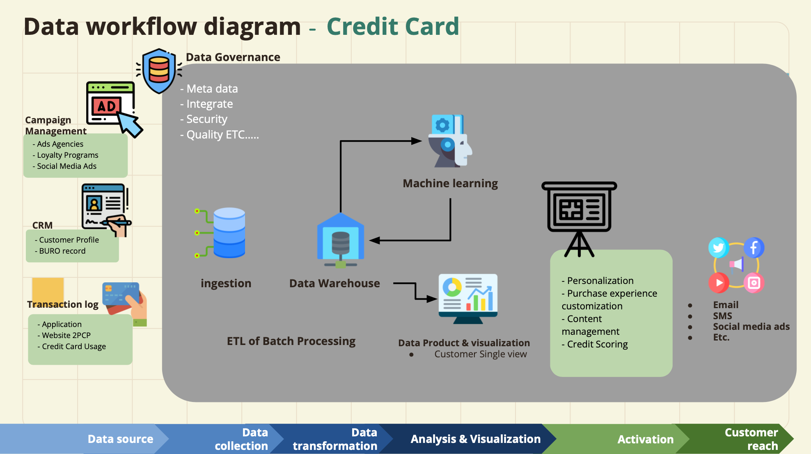
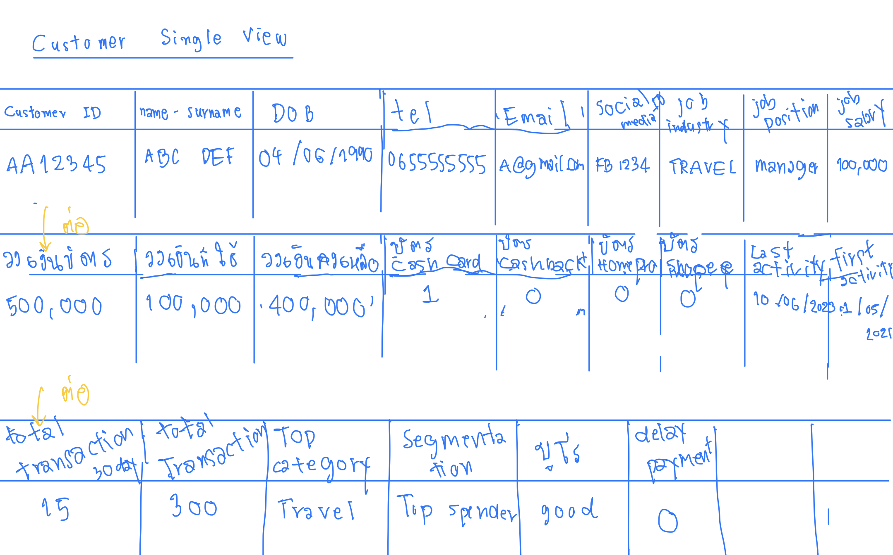
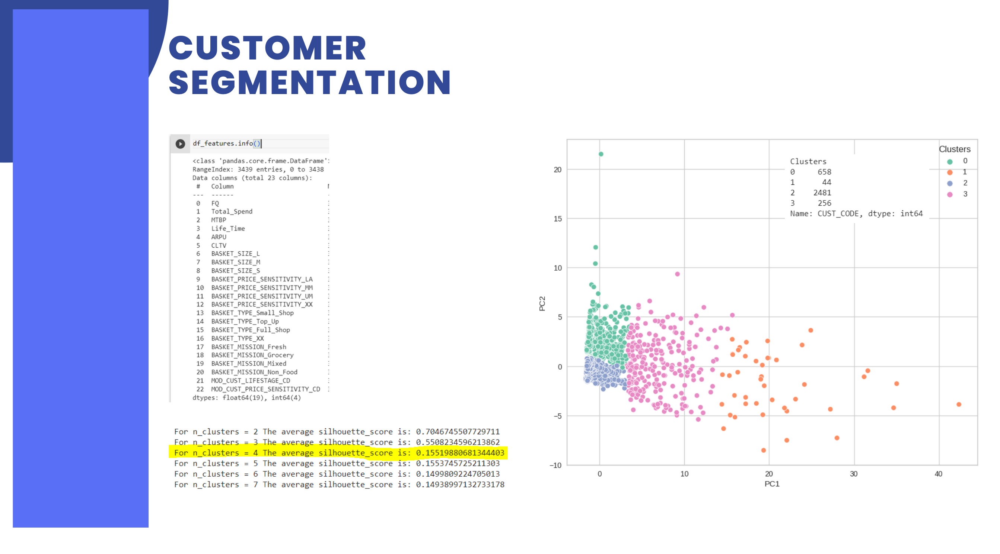
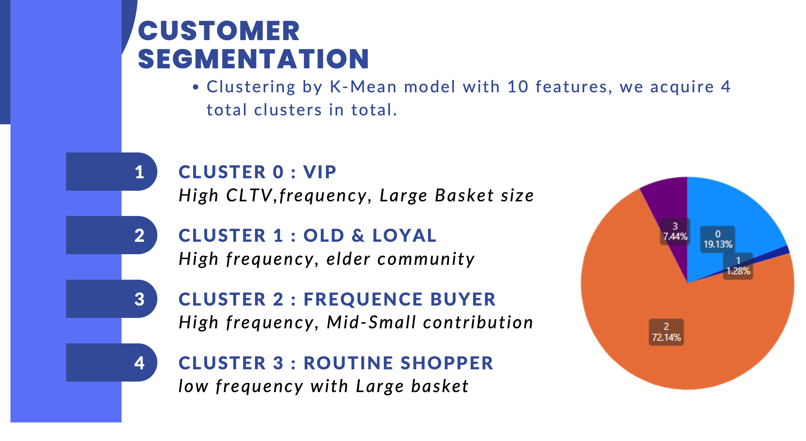

# Customer Data Platform
Customer Data Platform (CDP) เป็นเครื่องมือที่มีประโยชน์ซึ่งรวบรวมข้อมูลทั้งหมดเกี่ยวกับลูกค้าของคุณจากที่ต่างๆ ไว้ในโปรไฟล์เดียวที่เข้าใจง่าย ช่วยให้คุณเห็นภาพทั้งหมดของลูกค้าแต่ละราย รวมถึงการกระทำ ความชอบ และประวัติที่มีต่อธุรกิจของคุณ เป็นเครื่องมือที่มีคุณค่าสำหรับธุรกิจที่ต้องการสร้างความสัมพันธ์กับลูกค้าให้แน่นแฟ้นยิ่งขึ้นและประสบความสำเร็จในระยะยาว

### ประโยชน์ของการใช้แพลตฟอร์มข้อมูลลูกค้า
1. ประสบการณ์ส่วนบุคคล: CDP ช่วยให้คุณมอบประสบการณ์ที่เป็นส่วนตัวมากขึ้นแก่ลูกค้าแต่ละรายด้วยการทำความเข้าใจความต้องการและความสนใจของพวกเขา สิ่งนี้ทำให้พวกเขารู้สึกมีค่าและเพิ่มความภักดีต่อแบรนด์ของคุณ
2. การตลาดที่ดีขึ้น: ด้วย CDP คุณสามารถกำหนดเป้าหมายการตลาดของคุณได้อย่างมีประสิทธิภาพมากขึ้น คุณสามารถส่งข้อความที่เหมาะสมไปยังลูกค้าที่เหมาะสมในเวลาที่เหมาะสม ซึ่งนำไปสู่การมีส่วนร่วมที่สูงขึ้นและผลลัพธ์ที่ดีขึ้นจากแคมเปญการตลาดของคุณ
3. การตัดสินใจที่ได้รับการปรับปรุง: ข้อมูลเชิงลึกจาก CDP ช่วยให้คุณตัดสินใจได้อย่างชาญฉลาดขึ้นโดยอิงจากข้อมูล ไม่ใช่การคาดเดา สิ่งนี้นำไปสู่กลยุทธ์ที่ประสบความสำเร็จและผลลัพธ์ทางธุรกิจที่ดีขึ้น
4. ประสบการณ์ของลูกค้าที่สอดคล้องกัน: CDP ช่วยให้มั่นใจได้ว่าลูกค้าทุกคนจะได้รับประสบการณ์ที่สอดคล้องกัน ไม่ว่าพวกเขาจะใช้ช่องทางใดในการโต้ตอบกับธุรกิจของคุณ ความสอดคล้องนี้สร้างความไว้วางใจและเสริมสร้างภาพลักษณ์แบรนด์ของคุณ
5. ความเป็นส่วนตัวและความปลอดภัยของข้อมูล: CDP ให้ความสำคัญกับการรักษาข้อมูลลูกค้าให้ปลอดภัยและมั่นคง เพื่อให้มั่นใจว่าสอดคล้องกับกฎระเบียบด้านการคุ้มครองข้อมูล สิ่งนี้สร้างความไว้วางใจให้กับลูกค้าของคุณและปกป้องธุรกิจของคุณจากปัญหาทางกฎหมายที่อาจเกิดขึ้น
  

# Customer Single View
Customer Single View เป็นโปรไฟล์แบบครบวงจรที่รวมข้อมูลที่มีอยู่ทั้งหมดเกี่ยวกับลูกค้าไว้ในบันทึกเดียวที่เข้าถึงได้ง่าย ให้มุมมอง 360 องศาของลูกค้าแต่ละราย รวมถึงการโต้ตอบ ความชอบ ประวัติการซื้อ และพฤติกรรมผ่านจุดสัมผัสและช่องทางต่างๆ

### Single View Viables  
เราได้ยกตัวอย่างการวิเคราะห์ธุรกิจการทำสินเชื่อส่วนบุคคล  เพื่อจุดประสงค์การนำ Customer Single พร้อม"คิดตัวแปร"สำคัญๆที่เป็น Key Measure ในการช่วยประเมินการตัดสินใจก่อนอนุมัติการใช้งาน "บัตรเครดิต" รวมถึงการวิเคราะห์ในเชิง Analytic เพื่อเพิ่ม Economic Value ให้กับข้อมูล
##### Key Measures
* `Customer ID`,`Name-Surname`,`DOB`,`Tel.`,`Email`,`Social Media`,`Job Industry`,`Job Position`,`Job Salary`,`ETC...`

  

### Example of Analytic Usecases
- Recommended service : ในกรณีที่ลูกค้ามีการใช้บัตรเครดิตที่สูงแต่ `Top Category` ไม่ตรงตามประเภทบัตรที่ถือครอง `บัตร Cashback`,`บัตร Homepro`,`บัตร Shoppee`  สามารถCross Sale บัตรประเภทอื่นๆเพื่อสร้าง Customer Satifaction และ Loyalty จากการแนะนำที่เหมาะสมได้
- Maintain Customers : นำ `Last Activity` เพื่อดูการใช้การครั้งสุดท้ายและทำการ Reach out หาลูกค้าในกรณีที่มีพฤติกรรม Churn หรือสามารถนำ `Interval Time Between` มาวิเคาระห์เพ่ือหารูปแบบการใช้งานบัตรที่แม่นยำยิ่งขึ้น

# Segmentation with K-Mean 
การแบ่งกลุ่มลูกค้าโดยใช้ K-Means clustering เป็นเทคนิคที่จัดกลุ่มลูกค้าออกเป็นส่วนที่แตกต่างกันตามความคล้ายคลึงกัน
การแบ่งกลุ่ม K-Means ช่วยให้ธุรกิจระบุกลุ่มลูกค้าต่างๆ ตามลักษณะที่มีร่วมกัน ความเข้าใจนี้ช่วยให้สามารถปรับกลยุทธ์ทางการตลาดสำหรับแต่ละส่วนได้

### Number of Ks (Elbow and Silhouette)

ผู้ใช้เลือกจำนวนคลัสเตอร์ (K) ที่ต้องการสร้าง ค่าที่เหมาะสมของ K ขึ้นอยู่กับลักษณะของข้อมูลและระดับความละเอียดที่ต้องการในการแบ่งส่วนในที่นี้เราเลือกใช้ Elbow Method และ Silhouette Score เป็นสองเทคนิคยอดนิยมที่ใช้ในการกำหนดจำนวนคลัสเตอร์ที่เหมาะสมที่สุดในการจัดกลุ่ม K-Means ซึ่งช่วยในการระบุการจัดกลุ่มที่ดีที่สุดของจุดข้อมูลออกเป็นส่วนๆ

