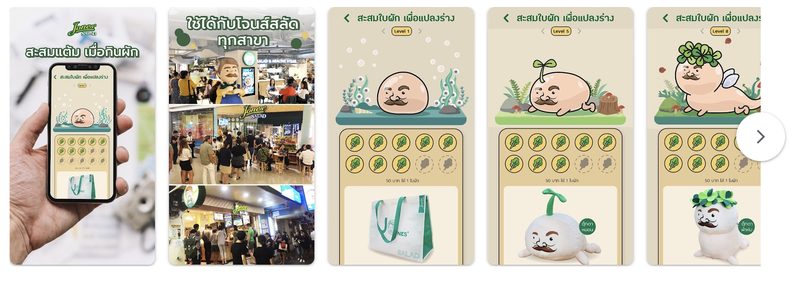
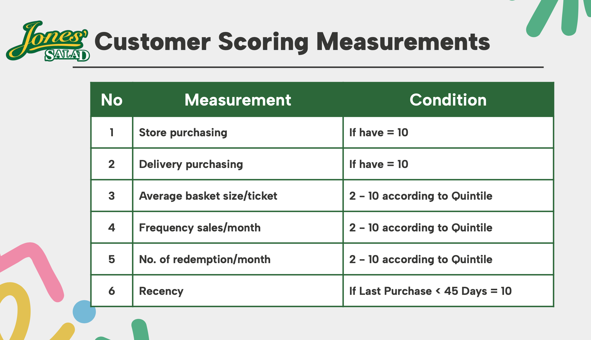
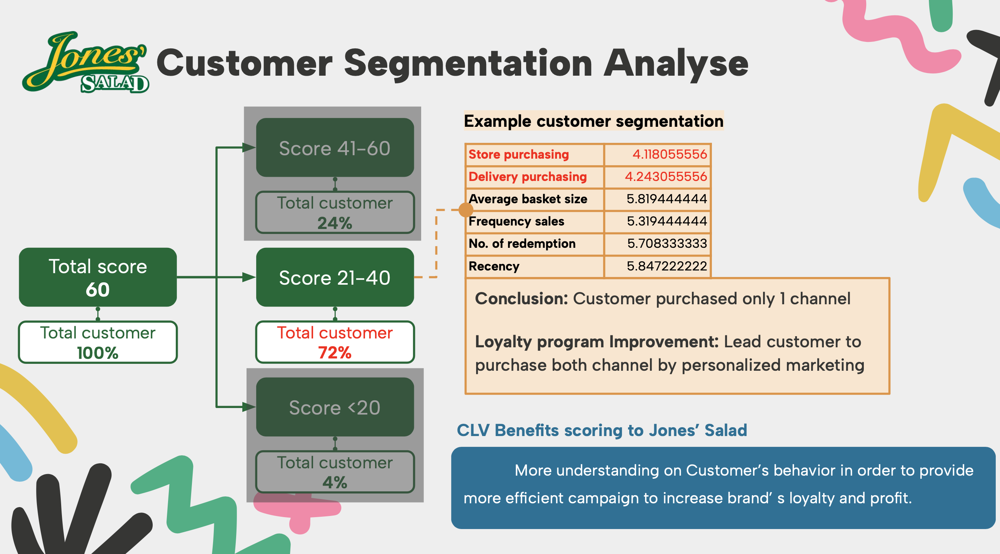

# Customer Lifetime Values
การทำความเข้าใจ CLTV ช่วยในการปรับแต่งการตลาดและการบริการลูกค้าให้เหมาะกับความต้องการของกลุ่มลูกค้าที่แตกต่างกันแบบ Personalize Marketing ซึ่งจะเป็นการเพิ่มความพึงพอใจและความภักดีของลูกค้ามาประยุกต์ใช้ในการทำ Loyalty Program โดยเราได้เลือกตัวอย่าง ร้่านอาหารชื่อดังที่เป็นที่จับตามองในยุคที่สุขภาพเป็นสิ่งที่ควรคำนึงถึง

# Loyalty Program As is
ในปัจุบัน JoneSalad มีการทำ Loyalty Program ผ่านการเก็บ Point ทุกครั้งที่ซื้อสินค้ากับทางร้านโดยแต้มนั้นหากสะสมถึงกำหนดแล้วจะสามารถนำไปแลกสินค้า Exclusive ต่างๆได้ เช่น หนังสือ หรือ ถุงผ้า

# Customer Socring Measurement for Segmentation Analyse
เราเริ่มจากการคิดตัวแปรต่างๆจุดประสงค์เพื่อที่จะแบ่งกลุ่มฐานลูกค้า โดยนำตัวแปรมาตั้งเป็น Rulebased แบ่งออกมาได้ 6 กลุ่มใหญ่

