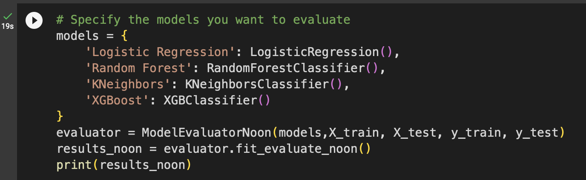
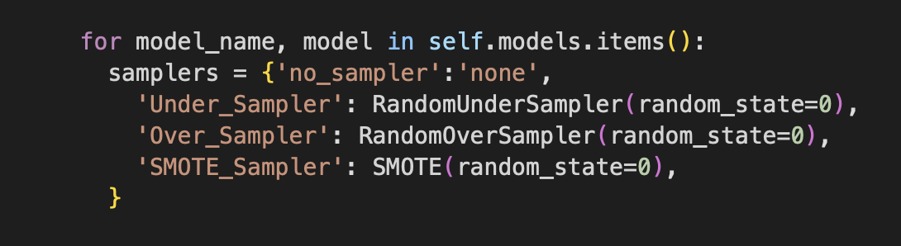
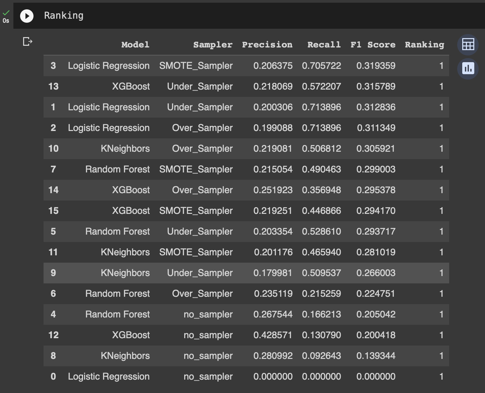

# Churn Scoring

 
 **Notebooks :** [Churn_Scoring](https://github.com/Alongkon128/MADT2-Cus.Analytics/blob/main/Workshop%203/Churn_scoring.ipynb)  

## _Case Analysis_
* Dataset : Non Contractial Customers : E-Commerce Industry
* Objevtive : Perform Feature Engineering to identify the importance viaribles, before go to machine learning
_New Customers > Active Customer > Inactive ( Window Period ) > Churn_

## _Methodology_
Split dataset to test set and train set, Labeling Churn in `E_COM DATASET` for ML to learn and identified the Behavior pattern of Churned Customer, finally to provide the propability score to forcast the leaving customers which can be converted beforehand.

### _ML Learning_

> ## **Logistic regression**
> 
>_OVER_SAMPLING (SMOTES TECH.)_ : For each minority class instance, SMOTE selects its k-nearest neighbors and generates synthetic examples by blending the feature vectors of the instance and its neighbors.
>>_OVER_SAMPLING_ : Randomly generates examples of instances from the majority class until the desired class balance is achieved.
>>>_UNDER_SAMPLING_ : Randomly select a subset of instances from the majority class until the desired class balance is achieved.
>
> ## **Random forest**
> 
>_OVER_SAMPLING (SMOTES TECH.)_
>>_OVER_SAMPLING_ 
>>>_UNDER_SAMPLING_ 
>
> ## **K-Nearest Neighbors**
> 
>_OVER_SAMPLING (SMOTES TECH.)_
>>_OVER_SAMPLING_ 
>>>_UNDER_SAMPLING_ 
>
> ## **XG Boost**
> 
>_OVER_SAMPLING (SMOTES TECH.)_
>>_OVER_SAMPLING_ 
>>>_UNDER_SAMPLING_ 
>

### _Result Model Scoring_

