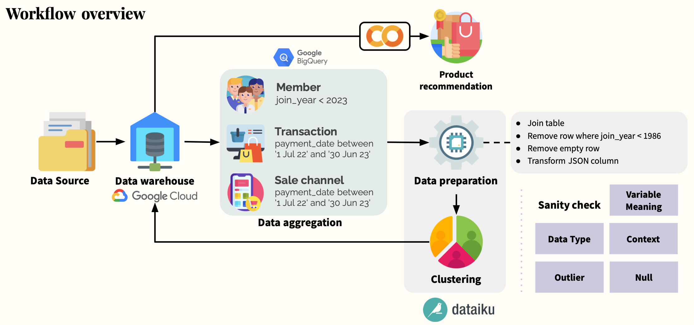

# Customer Segmentation to Product Recommended
   

# Overview
#### ........การทำ Segmentation คือ การแบ่งฐานผู้บริโภคในวงกว้างออกเป็นกลุ่มต่างๆ ตามคุณลักษณะหรืแที่มีร่วมกันตามตัวแปรที่เชื่อว่าเป็น Key Measure  เมื่อระบุกลุ่มเหล่านี้แล้ว จะสามารถสร้างคำแนะนำผลิตภัณฑ์ที่เหมาะกับแต่ละกลุ่มได้ User-Based (Collaborative-Filtering) ด้วยการทำความเข้าใจความต้องการและความชอบเฉพาะตัวของกลุ่มธุรกิจเหล่านี้ จึงสามารถเสนอ Recommend System ที่ตรงใจลูกค้าได้ดียิ่งขึ้นและการันตีการเพิ่มยอดขายให้แก่องค์กร

## Provided Data Set from HDI
1. Customer Profile : พร้อมข้อมูล hierarchy ของ `Downline` และ `Sponsors`
2. Transaction Logs : Sales records from year 2021 to 2022

## Used Data Set
1. Customer Profile
   - `registered_month` เป็นสมาชิกก่อน "2023"
2. Transaction Logs
   - `Payment_date` ที่นำมาวิเคราะห์ระหว่าง "01 July 22" - "01 June 23"

   

# 1) Create single customer view
#### Features 36 Viables : No., Field name, Meaning
* `member_id` : Define “ent” from member data as primary key
* `original_status` : -
* `sponsorship` : Influential power
* `registered_year` : Starting year of being  member 
* `registered_month` : Starting month of being  member 
* `member_duration` : Membership age since starting until current
* `no_of_purchasing` : Number of purchasing (Ticket counted)
* `total_spending` : Sum of sales amount
* `avg_spending` : Average total_spending per Ticket
* `total_product_qty` : Sum product quantity
* `total_product_qty_bycategory` : Sum product quantity by category (26 category)
* `category_count` : Count purchased category
* `sku_count` : Count purchased sku
* `Percent_paid` : Paid/Total_spending
* `avg_paid` : Percent_paid/no_of_purchasing
* `MTBP_Days` : (Last purchased-First purchased)/no. of purchasing
* `NO_CAT_rank` : Percentile of number of purchasing by category (26 category)
* `Percent_no_online` : total online transactions/total transactions

All the features are taken from single customer view table
#### Choosing K number of clusters
Choose `K = 4` with the lowest silhoette score of 0.26

#### Clustering Result

