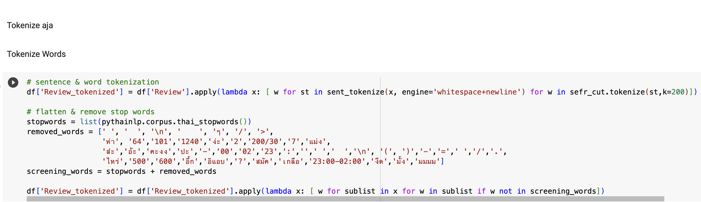
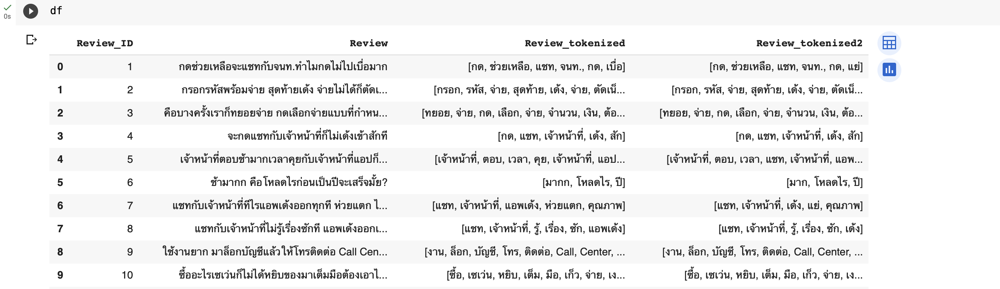
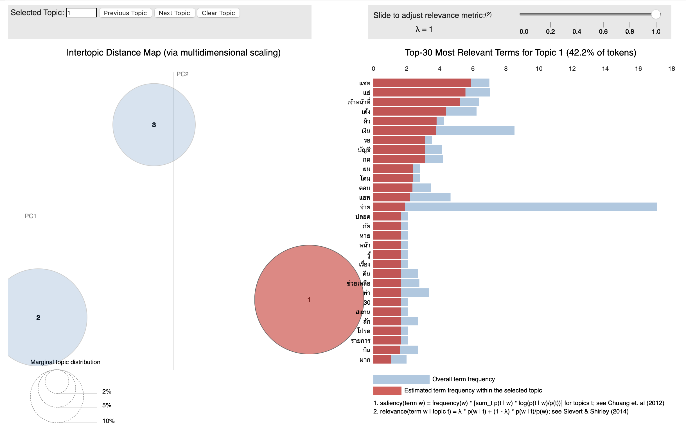

# Voice of Customer
#### ........กระบวนการรวบรวมและทำความเข้าใจความคิดเห็น ความคิดเห็น ความชอบ และความคาดหวังของลูกค้าเกี่ยวกับผลิตภัณฑ์ บริการ หรือแบรนด์ เป็นองค์ประกอบสำคัญของการจัดการประสบการณ์ลูกค้าและการพัฒนาผลิตภัณฑ์ ช่วยให้องค์กรต่างๆ จัดข้อเสนอให้สอดคล้องกับความต้องการและความปรารถนาของลูกค้า เช่น การวิเคราะห์ 'Sentiment' ของลูกค้าที่ฝังอยู่ในข้อความและรีวิวเป็นพันๆหมื่นๆข้อความ หรือแม้กระทั้งตอบโจทย์การเพิ่ม 'Satisfaction' ของลูกค้าในการบริการที่ Realtime & Accurated มาขึ้นจาก Chatbot Intellitegent

#### Benefit of LISTENING
1. **Filling in the Gaps:**
- การวิเคราะห์ VoC ช่วยระบุช่องว่างในการสื่อสาร การตลาด หรือผลิตภัณฑ์และบริการ โดยเผยให้เห็นส่วนที่ประสบการณ์ของลูกค้าไม่เป็นไปตามความคาดหวัง ทำให้เกิดการปรับเปลี่ยนและปรับปรุงได้
2. **Increasing Customer Loyalty:**
- ประสบการณ์เชิงบวกของลูกค้า ซึ่งขับเคลื่อนโดยข้อมูลเชิงลึกของ VoC ช่วยเพิ่มความภักดีของลูกค้า ผลการศึกษาพบว่าประสบการณ์ของลูกค้ามีส่วนสำคัญในการรักษาลูกค้าไว้
3. **Product Research and Development:**
- ความคิดเห็นของ VoC ให้ข้อมูลเชิงลึกที่มีคุณค่าเกี่ยวกับมุมมองของลูกค้า ช่วยให้เข้าใจประเด็นที่เป็นปัญหาและความต้องการ ข้อมูลเชิงลึกเหล่านี้เป็นแรงบันดาลใจในการปรับปรุงผลิตภัณฑ์และฟีเจอร์ ส่งเสริมการมีส่วนร่วมและความไว้วางใจของลูกค้า
4. **Crisis Management:**
- การตรวจสอบ VoC แบบเรียลไทม์ช่วยให้สามารถคาดการณ์ปัญหาเชิงรุกได้ ช่วยในการแก้ไขปัญหาต่างๆ เช่น ความผิดปกติของผลิตภัณฑ์หรือฟีเจอร์ ก่อนที่จะบานปลาย ช่วยเพิ่มชื่อเสียงของแบรนด์และความพึงพอใจของลูกค้า
#### VoC Tools
> `Sentiment analysis`
> 
> `Fake review identification`
> 
> `Topic identification`
> 
> `Named entity recognition`
  #### Natural language processing (NLP) 
  - การประมวลผลภาษาธรรมชาติ (NLP) เป็นเทคโนโลยีแมชชีนเลิร์นนิ่งที่ช่วยให้คอมพิวเตอร์สามารถตีความ จัดการ และทำความเข้าใจภาษามนุษย์ได้ องค์กรในปัจจุบันมีข้อมูลเสียงและข้อความจำนวนมากจากช่องทางการสื่อสารต่างๆ เช่น อีเมล ข้อความ ฟีดข่าวโซเชียลมีเดีย วิดีโอ เสียง และอื่นๆ พวกเขาใช้ซอฟต์แวร์ NLP เพื่อประมวลผลข้อมูลนี้โดยอัตโนมัติ 

# Case Analysis
   

### _'TrueMoney' Application (by 'True Money Company Limtied')_
ทรูมันนี่ คือแอปพลิเคชันทางการเงินที่ให้บริการครบวงจรทั้งการใช้จ่าย ออมเงินพร้อมรับดอกเบี้ย หรือแม้กระทั้งการลงทุน อีกทั้งยังสามารถใช้ 'Wallet' จ่ายแทนเงินสดได้ทั้งใช้ซื้อสินค้าที่เซเว่น-อีเลฟเว่น จ่ายบิล เติมเงินมือถือและอื่นๆ 

         
### _Business Objective_
   - `Active Users` ลดลงจากเดิมไปเรื่อยๆจึงอยากนำข้อมูลของลูกค้าที่มีนำวิเคราะห์และประยุกต์ให้เกิดประโยชน์สูงสุด
### _Action Plan_
   - นำข้อมูลคอมเม้นและรีวิวของ`Users` บน Appstore Platform เพิ่อวิเคราะห์หา Sentiment หรือ Voice of Customers พร้อมนำไปปรับปรุงเพื่อสร้าง UX/UI ที่ดีให้กับลูกค้าที่ใช้งาน 'TrueMoney' Application 
### _Data Strategy_
ประยุกต์การทำ NLP : topic modelling by using LDA โดย 
##### REMARKED : Natural language processing (NLP) การประมวลผลภาษาธรรมชาติ (NLP) เป็นเทคโนโลยีแมชชีนเลิร์นนิ่งที่ช่วยให้คอมพิวเตอร์สามารถตีความ จัดการ และทำความเข้าใจภาษามนุษย์ได้ องค์กรในปัจจุบันมีข้อมูลเสียงและข้อความจำนวนมากจากช่องทางการสื่อสารต่างๆ เช่น อีเมล ข้อความ ฟีดข่าวโซเชียลมีเดีย วิดีโอ เสียง และอื่นๆ พวกเขาใช้ซอฟต์แวร์ NLP เพื่อประมวลผลข้อมูลนี้โดยอัตโนมัติ 
#### Dataset:
* 28 Comments in Total reviewed on`Appstore` ขนาดไฟล์ `CSV Document - 10 KB`
#### Methodology 
>**PYthaiNLP** : Removed Thai Stopwords and Some Selected Syntax
>>**Tokenize**  : Tokenize words to see Result
>>>**Replace Word**  : Grouping Words with similar Meaning
>>>>**Tokenize**  : Tokenize words to see Result
>>>>>**Dictionary**  : Create Dic. for Tokenized word

>**NLP : Topic Modeling** : Removed Thai Stopwords and Some Selected Syntax
>>**num_topics** = 3
>>>**hunksize** = 4000
>>>>**passes through documents** = 20
>>>>>**iterations** = 50
>>>>>>**evaluate model every** = 1 

 _Result to Business Recommendation_
........กล่าวโดยสรุปได้ว่าหลังจากพิจารณา Result ที่ได้จากการทำ Topic Modeling ในครั้งนี้แล้วจึงสามารถนำไปประยุกต์ ปรับเปลี่ยน แก้ไข ปรับปรุงเพื่อเพิ่มประสบการณ์ที่ดียิ่งขึ้นของ Users ได้ผ่านการทำ UX/UI อีกที
####ตัวอย่างจาก กลุ่มคำที่ผ่านการจับกลุ่มตามหัวข้อจะสังเกตได้ว่ามี `แชท`, `เจ้าหน้าที่`, `แย่`, `คิว`, `เด้ง` ถึงแม้ว่าทาง _'TrueMoney'_จะมีระบบคอลเซ็นเตอร์เพื่อการรองรับลูกค้าหรือ _"AI Chatbot"_ แต่อาจจะมีจุดให้ปรับปรุงในด้านของการบริการและความเสถียรของ Chatbot

_Example_
* ลูกค้ารอ`คิว`เพื่อที่จะ`แชท`กับ `เจ้าหน้าที่`แต่พอถึง `คิว` แล้ว Application เกิดปัญหาทำให้ `เด้ง`ออก  
